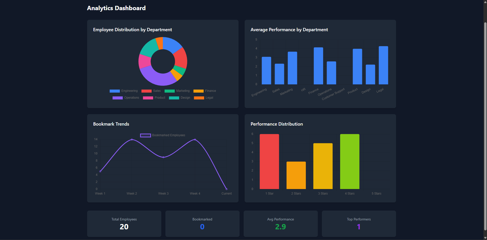
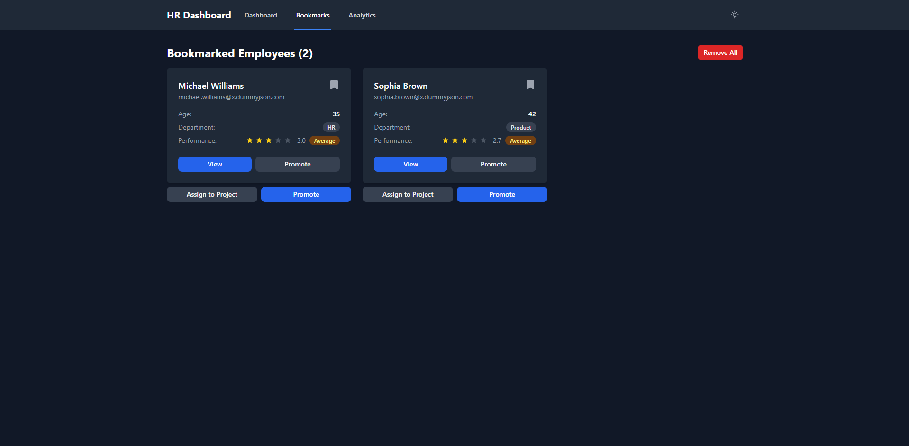
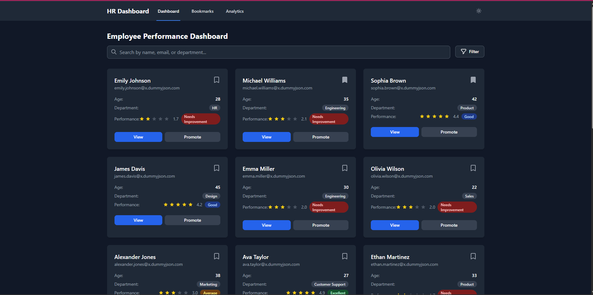
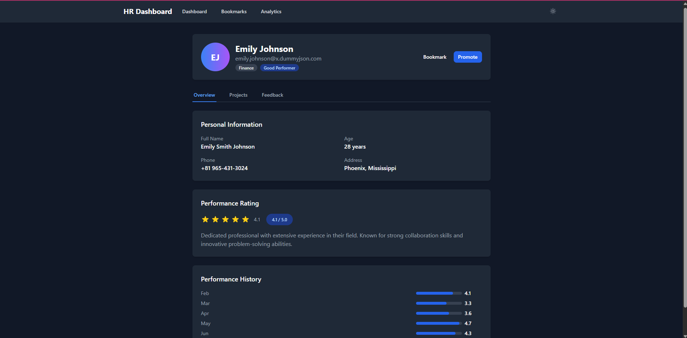
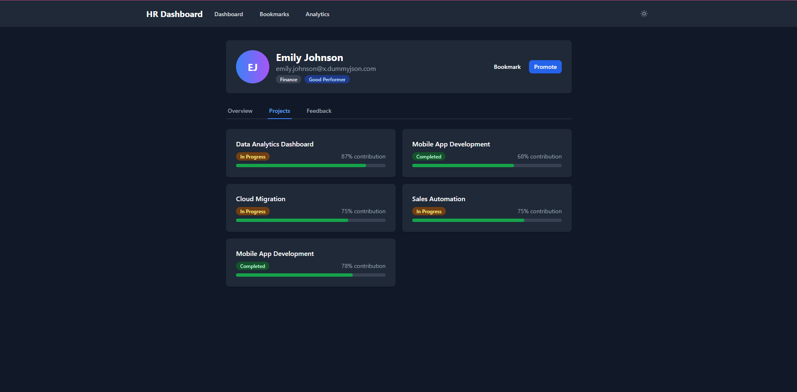
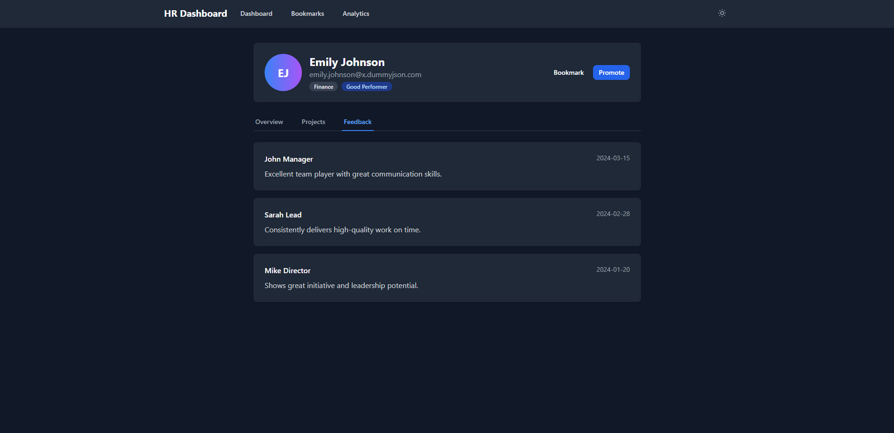
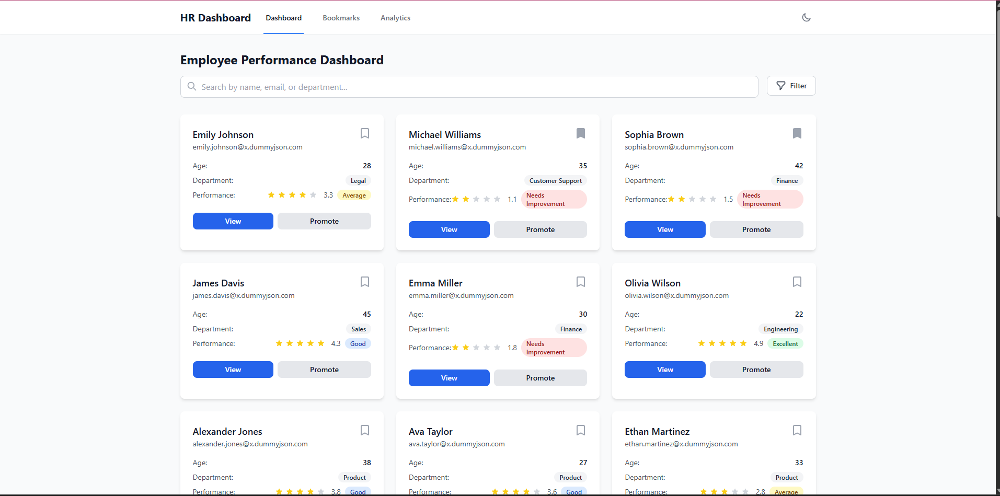
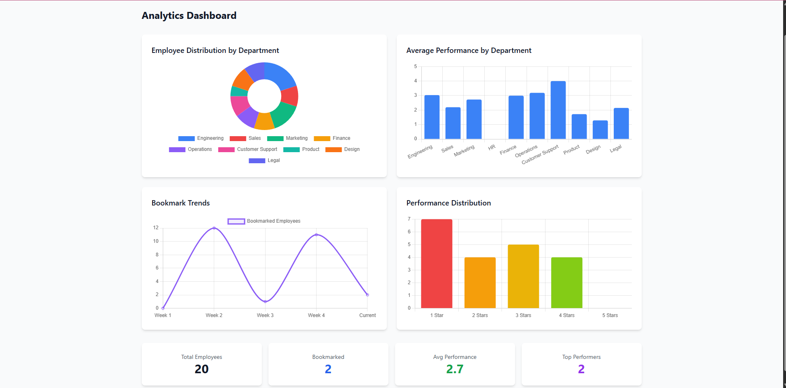

# 💼 HR Performance Dashboard

A modern, responsive HR dashboard built with Next.js 14, React, and Tailwind CSS for tracking employee performance, managing bookmarks, and viewing analytics.

## 📸 Screenshots

### Dashboard Homepage

*Main dashboard showing employee cards with performance ratings and quick actions*

### Search & Filter

*Advanced search and filtering capabilities by name, department, and performance rating*

### Employee Details - Overview

*Detailed employee profile with personal information and performance history*

### Employee Details - Projects

*Project involvement and contribution tracking*

### Employee Details - Feedback

*Performance feedback from managers and colleagues*

### Bookmarks Page

*Manage bookmarked employees with quick actions*

### Analytics Dashboard

*Comprehensive analytics with charts showing department distribution, performance metrics, and trends*

### Dark Mode

*Full dark mode support for comfortable viewing*

## 🚀 Features Implemented

### Core Features
- ✅ **Dashboard Homepage** - Employee cards with ratings, search, and filter
- ✅ **Advanced Search** - Search by name, email, or department (case-insensitive)
- ✅ **Multi-Select Filters** - Filter by department and performance rating
- ✅ **Dynamic Employee Details** - Detailed profiles with tabbed interface
- ✅ **Bookmark System** - Save and manage favorite employees
- ✅ **Analytics Dashboard** - Visual insights with Chart.js
- ✅ **Dark/Light Mode** - Theme toggle with persistence
- ✅ **Responsive Design** - Mobile-first approach, works on all devices
- ✅ **State Management** - Zustand for global state with persistence
- ✅ **Custom Hooks** - Reusable logic for bookmarks and search

### Technical Features
- 🏗️ **Next.js 14 App Router** - Modern routing and server components
- 🎨 **Tailwind CSS** - Utility-first styling
- 📊 **Chart.js Integration** - Beautiful data visualizations
- 🔄 **Real-time Filtering** - Instant search results
- 💾 **Local Storage** - Persistent bookmarks and theme
- 🎯 **TypeScript-ready** - Can be easily converted to TypeScript
- ♿ **Accessibility** - Keyboard navigation and ARIA labels

## 🛠️ Tech Stack

- **Framework:** Next.js 14 (App Router)
- **UI Library:** React 18
- **Styling:** Tailwind CSS 3
- **State Management:** Zustand 4
- **Charts:** Chart.js + react-chartjs-2
- **Data Source:** DummyJSON API
- **Language:** JavaScript (ES6+)

## 📋 Prerequisites

- Node.js 16.x or higher
- npm or yarn package manager
- Git (for cloning the repository)

## 🔧 Installation & Setup

1. **Clone the repository**
   ```bash
   git clone https://github.com/yourusername/hr-dashboard.git
   cd hr-dashboard
   ```

2. **Install dependencies**
   ```bash
   npm install
   # or
   yarn install
   ```

3. **Run the development server**
   ```bash
   npm run dev
   # or
   yarn dev
   ```

4. **Open your browser**
   Navigate to [http://localhost:3000](http://localhost:3000)

## 📁 Project Structure

```
hr-dashboard/
├── app/                      # Next.js App Router pages
│   ├── page.js              # Dashboard homepage
│   ├── layout.js            # Root layout with theme provider
│   ├── globals.css          # Global styles and Tailwind imports
│   ├── employee/
│   │   └── [id]/
│   │       └── page.js      # Dynamic employee details page
│   ├── bookmarks/
│   │   └── page.js          # Bookmarks management page
│   └── analytics/
│       └── page.js          # Analytics dashboard
├── components/              # Reusable React components
│   ├── Navigation.js        # Main navigation bar
│   ├── EmployeeCard.js      # Employee card component
│   ├── SearchBar.js         # Search input component
│   ├── FilterDropdown.js    # Multi-select filter dropdown
│   ├── ThemeProvider.js     # Dark/light mode context
│   ├── Button.js            # Reusable button component
│   ├── Card.js              # Card container component
│   ├── Badge.js             # Status badge component
│   └── RatingBar.js         # Star rating display
├── hooks/                   # Custom React hooks
│   ├── useBookmarks.js      # Bookmark management hook
│   └── useSearch.js         # Search and filter hook
├── store/                   # State management
│   └── useStore.js          # Zustand store configuration
├── lib/                     # Utility functions
│   └── utils.js             # Helper functions and constants
├── screenshots/             # Application screenshots
├── public/                  # Static assets
├── package.json            # Project dependencies
├── next.config.js          # Next.js configuration
├── tailwind.config.js      # Tailwind CSS configuration
├── postcss.config.js       # PostCSS configuration
└── README.md               # Project documentation
```

## 🎯 Usage Guide

### Dashboard Navigation
- Use the top navigation bar to switch between Dashboard, Bookmarks, and Analytics
- Toggle dark/light mode using the theme button in the navigation

### Employee Management
1. **Search:** Type in the search bar to find employees by name, email, or department
2. **Filter:** Click the filter button to select departments or performance ratings
3. **View Details:** Click "View" on any employee card to see detailed information
4. **Bookmark:** Click the bookmark icon to save employees for quick access
5. **Promote:** Click "Promote" to trigger promotion workflow (UI action)

### Bookmarks
- Access all bookmarked employees from the Bookmarks page
- Remove individual bookmarks or clear all at once
- Quick actions: Assign to Project, Promote

### Analytics
- View department-wise employee distribution
- Monitor average performance by department
- Track bookmark trends over time
- Analyze performance distribution across all employees

## 🚀 Scripts

```bash
# Development
npm run dev          # Start development server

# Production
npm run build        # Build for production
npm start            # Start production server

# Linting
npm run lint         # Run ESLint
```

## 🔮 Future Enhancements

- [ ] Add authentication with NextAuth.js
- [ ] Implement real employee data API integration
- [ ] Add employee creation and editing capabilities
- [ ] Export analytics data to PDF/Excel
- [ ] Add more chart types and customization
- [ ] Implement pagination for large datasets
- [ ] Add email notifications for performance reviews
- [ ] Create mobile app with React Native

## 🤝 Contributing

1. Fork the repository
2. Create your feature branch (`git checkout -b feature/AmazingFeature`)
3. Commit your changes (`git commit -m 'Add some AmazingFeature'`)
4. Push to the branch (`git push origin feature/AmazingFeature`)
5. Open a Pull Request

## 📄 License

This project is licensed under the ISC License - see the LICENSE file for details.

## 👏 Acknowledgments

- [DummyJSON](https://dummyjson.com/) for providing mock user data
- [Chart.js](https://www.chartjs.org/) for beautiful charts
- [Tailwind CSS](https://tailwindcss.com/) for utility-first styling
- [Next.js](https://nextjs.org/) for the amazing framework

---

Built with ❤️ for the HR Dashboard Challenge